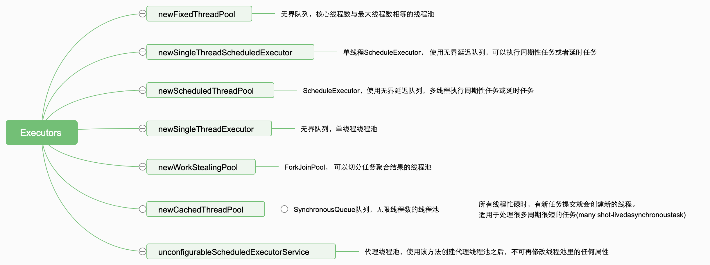

## 常用的线程池
阻塞线程池：核心线程数等于最大线程数，队列长度很短，队列满了之后会阻塞主调方线程。适合并行执行子任务，提高响应速度的场景  
动态线程池  
顺序消费线程池

## Java标准线程池

1. FixedThreadPool拥有一个无界队列，意味着我们可以一直往线程池里提交任务，这样可能造成任务堆积，进而导致OOM，这是很危险的。  
2. FixedThreadPool拥有一个无界队列，意味着最大线程数失效，所以设定核心线程数等于最大线程数。  
3. CachedThreadPool是可以无限创建线程的线程池，它本身并不会hold任务，而是缓存线程，线程空闲60秒后会被销毁和回收资源，当所有线程忙碌时，每来一个新任务就创建一个线程处理，这样的话，极端情况下会耗尽CPU和内存资源。另外从注释可以看出该线程池适用于短周期任务，而一般业务中在使用线程池时基本都会有IO，耗时会比较长，所以业务角度来看，CachedThreadPool也不适合。  
4. ScheduledThreadPool使用延迟队列DelayedWorkQueue（即按照下次执行时间排序的优先队列），所有添加的任务都会被加入到队列中，然后执行，如果是周期性的任务会重新加入到队列中定期执行。

## 线程池原理
### 原理图

### 任务管理
任务调度  
阻塞队列  
- ArrayBlockingQueue
- LinkedBlockingQueue
- PriorityBlockingQueue
- DelayQueue
- SynchronousQueue
- LinkedTransferQueue
- LinkedBlockingDeque

任务申请 getTask()  
拒绝策略  
- CallerRunsPolicy
- AbortPolicy
- DiscardPolicy
- DiscardOldestPolicy

### 线程管理
Worker线程结构  
Worker线程增加 addWorker()  
Worker线程回收 processWorkerExit()  
Worker线程执行任务 runWorker()

### 使用场景
在实际应用中我们获取并发性的场景主要是两种：
1. 并行执行子任务，提高响应速度。这种情况下，应该使用同步队列，没有什么任务应该被缓存下来，而是应该立即执行。
2. 并行执行大批次任务，提升吞吐量。这种情况下，应该使用有界队列，使用队列去缓冲大批量的任务，队列容量必须声明，防止任务无限制堆积。

## 参考文档
https://tech.meituan.com/2020/04/02/java-pooling-pratice-in-meituan.html  
https://blog.csdn.net/Firstlucky77/article/details/124730067
